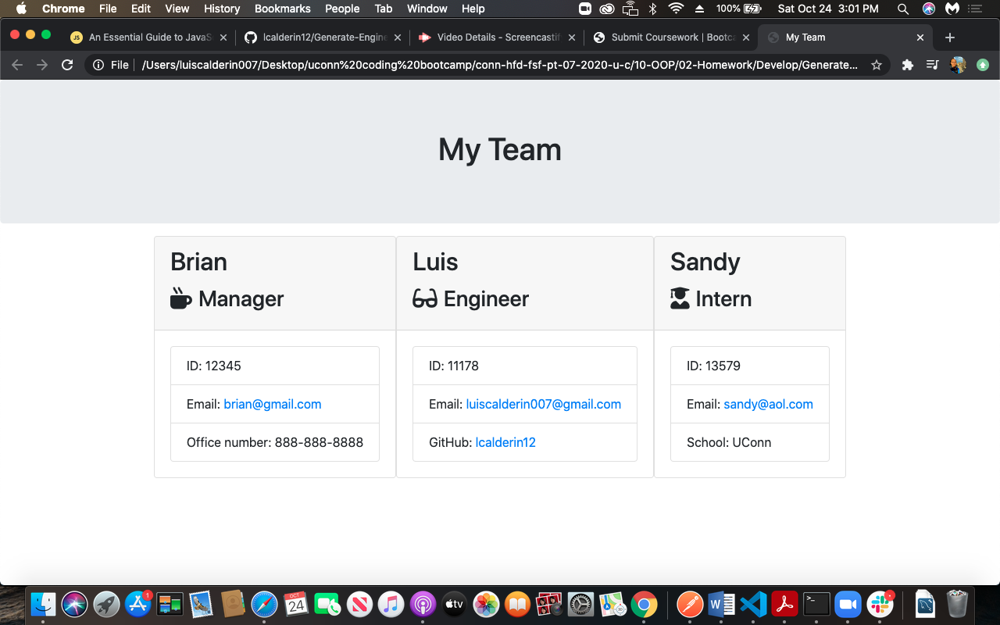

# Engineer Team Generator
  
## Screenshots

 

## Table of contents
- [Description](#Description)
- [Installation](#Installation)
- [Usage](#Usage)
- [Test](#Test)
- [Repository Link](#Repositories)
- [Questions](#Questions?)
- [GitHub Info](#GitHub) 
## Description 
This team generating app will create a number of employees. The team will be composed of a manager and any number of engineers and interns. All employees will have the same input of name, id, and email. An office number input will be provided if a manager is chosen, a github account for an engineer, and a school name for an intern respectively. After all the information is presented a HTML file will be rendered with all the proper details and team members.
## Installation
npm Install jest and inquirer using node.
## Usage
Use it to create team template of engineers
## Test
use jest with the provided code
## Repositories
- [GitHub Portfolio](https://github.com/lcalderin12)
- [Project Repo](git@github.com:lcalderin12/Generate-Engineering-Team.git)
## Questions?
- lcalderin12
- luiscalderin12@gmail.com
## GitHub Profile

- Luis Calderin
